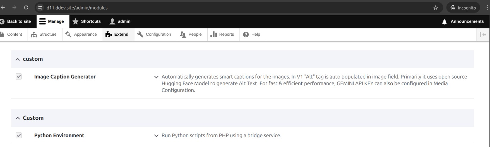
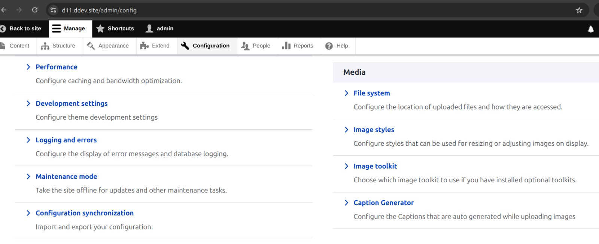
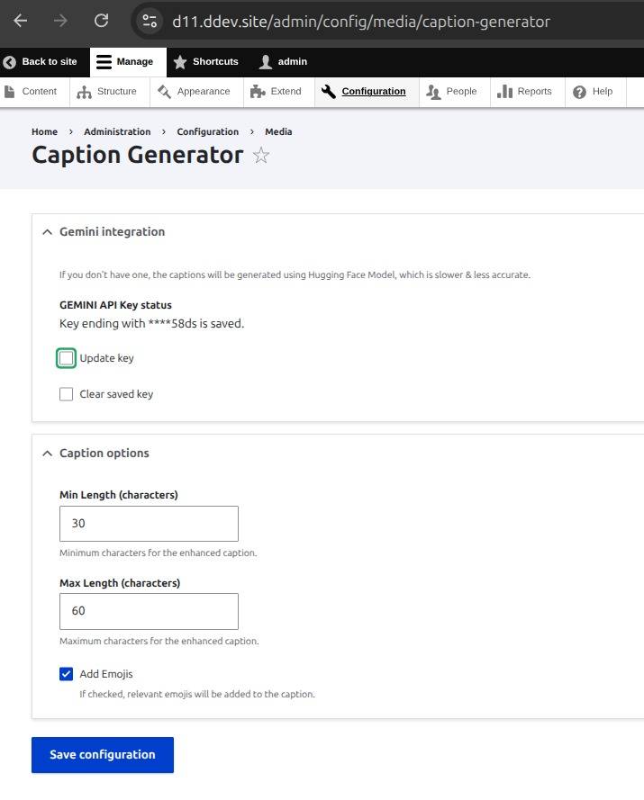
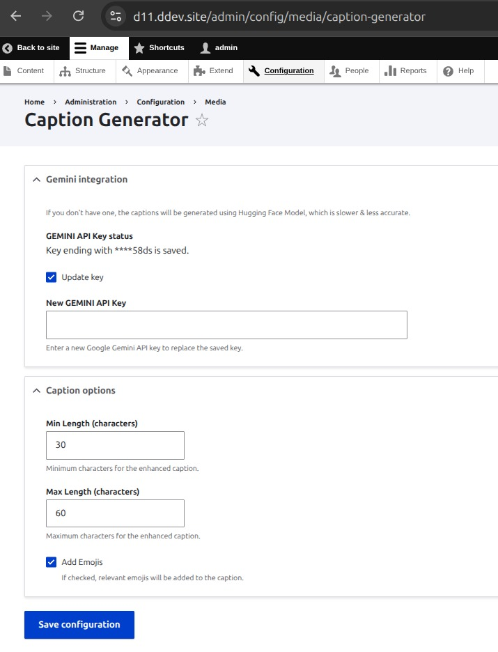
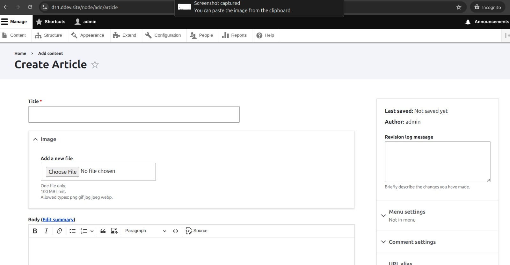
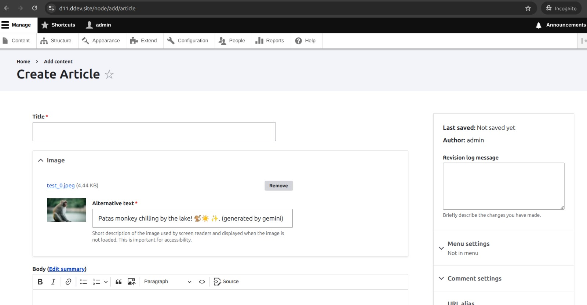
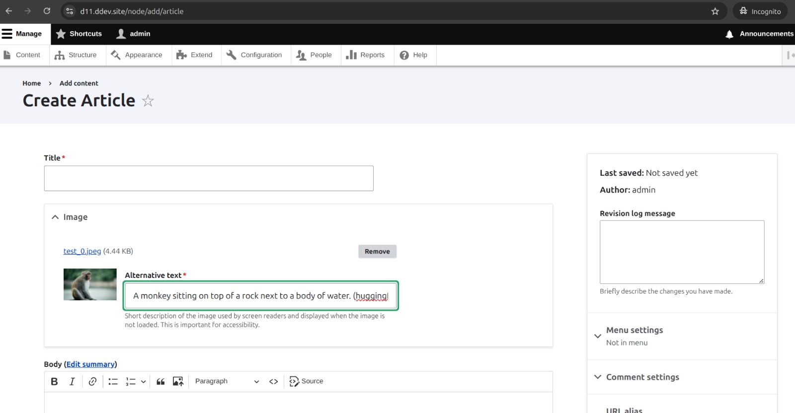

# Drupal 11 Image Caption Generator Module

A powerful Drupal 11 module that automatically generates intelligent captions for images using AI models. The module integrates with Hugging Face models for offline caption generation and optionally uses Google Gemini API for enhanced results.

## Features

- **Automatic Alt Text Generation**: Automatically populates the Alt tag field when images are uploaded to articles
- **AI-Powered Captions**: Uses state-of-the-art Hugging Face models for intelligent image understanding
- **Offline Capability**: Works without external API keys using cached models
- **Gemini API Integration**: Optional integration with Google Gemini API for enhanced caption quality
- **Smart Classification**: Automatically classifies images and generates contextually relevant captions
- **Configurable Settings**: Easy-to-use configuration interface in Drupal admin
- **Performance Optimized**: Efficient model loading and caching for fast response times

## Prerequisites

- Drupal 11.x
- PHP 8.2+
- Python 3.8+
- Docker (recommended for containerized setup)
- Composer
- DDEV (optional, but recommended for local development)

## Installation Steps

### 1. Install Drupal 11

First, ensure you have Drupal 11 installed and running on your system.

### 2. Install Python Environment Module

Install the required Python Environment custom module using Composer:

```bash
composer require 'drupal/python_env:^1.0'
```

### 3. Install Module Files

Manually copy and paste all files from this project to your Drupal installation:

```bash
# Copy the module to your Drupal modules directory
cp -r web/modules/caption_generator /path/to/your/drupal/web/modules/custom/

# Copy Python backend files
cp -r python /path/to/your/drupal/
```

### 4. Restart Container

Restart your Docker container or web server. The system will automatically:

- Install Python requirements
- Download and cache AI models for offline caption generation
- Start the Python API server on port 8000

## Visual Installation Guide

### Step 1: Install Python Environment & Image Caption Generator Module



### Step 2: Go to Manage > Configuration > Media Section > Caption Generator



### Step 3: Choose Your Preference

#### Option 3.1: With Gemini API Key


#### Option 3.2: Without Gemini API Key (Hugging Face Only)


### Step 4: Go to New Article & Upload Any Image



## Demo Video

Watch the complete installation and usage process:

[](https://raw.githubusercontent.com/SohamLad14/ladsoham-gsoc-caption-generator/main/readme-resources/sample-recording.mp4)

## DDEV Integration (Recommended)

If you're using DDEV for local development, this project includes custom DDEV commands that automate the setup process:

### Available DDEV Commands

1. **Install Python Requirements**
   ```bash
   ddev install-python-reqs
   ```
   - Creates Python virtual environment
   - Installs all required Python packages

2. **Preload AI Models**
   ```bash
   ddev preload-models
   ```
   - Downloads and caches all required AI models
   - Includes BLIP (captioning), ViT (classification), and GPT-2 (enhancement)
   - Models are cached locally for offline operation

3. **Start Python Development Server**
   ```bash
   ddev dev-python
   ```
   - Starts the FastAPI server on port 8000
   - Uses cached models for fast startup
   - Configured for development with proper environment variables

### DDEV Setup Workflow

```bash
# 1. Install Python requirements
ddev install-python-reqs

# 2. Preload AI models (this may take a few minutes)
ddev preload-models

# 3. Start the Python API server
ddev dev-python
```

**Note**: The `preload-models` command only needs to be run once. Subsequent runs will use the cached models for faster startup.

## Configuration

### Enable the Module

1. Navigate to **Extend** in your Drupal admin panel
2. Find "Image Caption Generator" in the Custom section
3. Check the box and click "Install"

### Configure Settings

1. Go to **Manage > Configuration > Media Section > Caption Generator**
2. Configure the following settings:
   - **Gemini API Key**: (Optional) Enter your Google Gemini API key for enhanced captions
   - **Default Caption Length**: Set the default length for generated captions
   - **Enable Emojis**: Toggle emoji inclusion in captions
   - **Model Settings**: Configure AI model parameters

## How It Works

### Automatic Alt Text Population

When you upload an image to an article:

1. The module detects the image upload
2. Sends the image to the Python AI backend
3. Generates a contextually relevant caption
4. Automatically populates the Alt tag field
5. Users can still edit the generated caption if needed

### Results Comparison

#### Using Gemini API (Enhanced Quality)


#### Using Hugging Face Models (Offline Operation)


### AI Models Used

- **Image Classification**: Identifies objects, scenes, and context in images
- **Caption Generation**: Creates natural language descriptions
- **Caption Enhancement**: Improves captions using classification results and optional Gemini API

### Backend Architecture

- **FastAPI Server**: Runs on port 8000 for high-performance image processing
- **Model Caching**: Downloads and caches AI models for offline operation
- **Error Handling**: Graceful fallbacks when models or APIs are unavailable

## Usage

### For Content Editors

1. **Create/Edit an Article**: Navigate to Content > Add content > Article
2. **Upload an Image**: Add an image to the article using the image field
3. **Automatic Caption**: The Alt tag will be automatically populated with a generated caption
4. **Edit if Needed**: You can modify the generated caption before saving

### For Developers

The module provides several services that can be used in custom code:

```php
// Get the caption generator service
$caption_service = \Drupal::service('caption_generator.python_api');

// Generate a caption for an image
$caption = $caption_service->generateCaption($image_path, $length);
```

## File Structure

```
caption_generator/
├── caption_generator.info.yml          # Module information
├── caption_generator.module            # Main module file
├── caption_generator.routing.yml       # Route definitions
├── caption_generator.services.yml      # Service definitions
├── src/
│   ├── Controller/                     # Controller classes
│   ├── Form/                          # Configuration forms
│   └── Service/                       # Service classes
└── config/                            # Configuration schemas

python/                                # Python backend
├── api.py                             # FastAPI server
├── caption.py                         # Caption generation logic
├── enhancer.py                        # Caption enhancement
├── requirements.txt                   # Python dependencies
└── standalone_caption.py             # Standalone caption tool
```

## Troubleshooting

### Common Issues

1. **Module Not Found**: Ensure all files are copied to the correct directories
2. **Python API Not Starting**: Check Python dependencies and port 8000 availability
3. **Models Not Loading**: Verify internet connection for initial model download
4. **Captions Not Generating**: Check Drupal logs for error messages

### Debug Information

- Check Drupal logs at `/admin/reports/dblog`
- Verify Python API health at `http://localhost:8000/health`
- Check module status at `/admin/modules`

### Performance Tips

- The first image upload may be slower as models are loaded
- Subsequent uploads will be faster due to model caching
- Consider using Gemini API for production environments requiring high-quality captions

## API Endpoints

The Python backend provides the following endpoints:

- `GET /health` - Health check and model status
- `POST /generate` - Generate caption for uploaded image

## Dependencies

### Drupal Dependencies
- `drupal:python_env`

### Python Dependencies
- FastAPI
- PyTorch
- Transformers
- Pillow
- Google Generative AI
- And more (see `python/requirements.txt`)

## Support

For issues and questions:

1. Check the troubleshooting section above
2. Review Drupal and Python logs
3. Verify all installation steps were completed correctly
4. Ensure system requirements are met

## License

This module is provided as-is for educational and development purposes.

## Version

Current Version: 1.0
Compatible with: Drupal 11.x # ladsoham-gsoc-caption-generator
